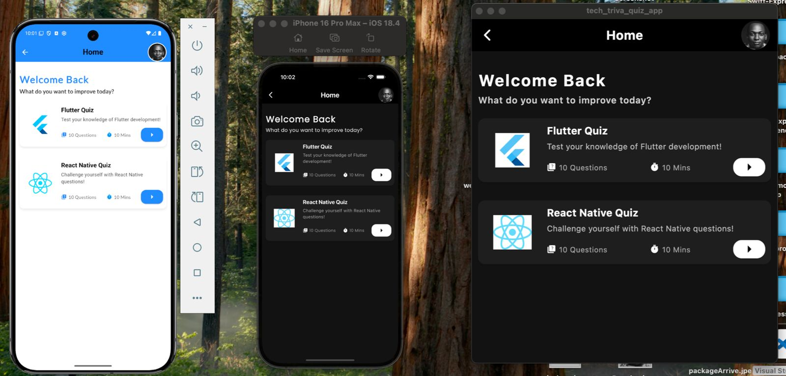
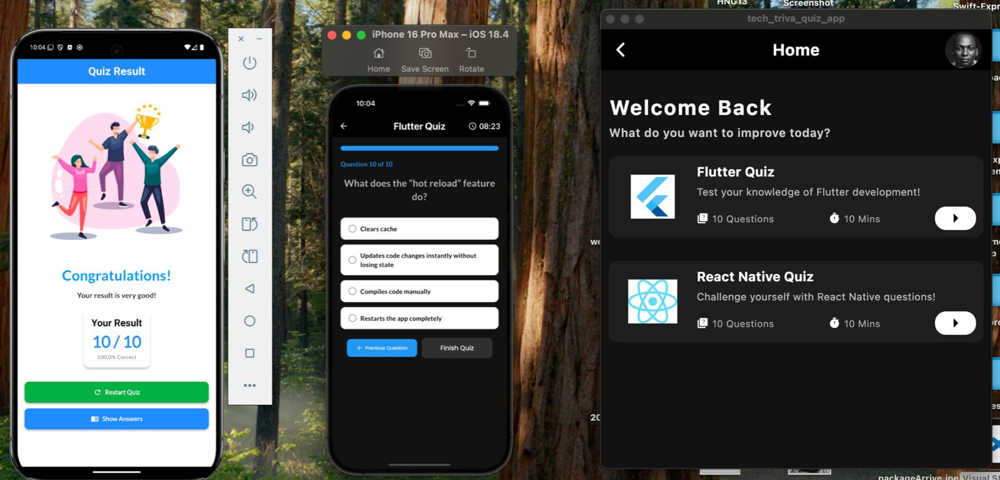

# tecSure! Here's a **professional, clean, and informative GitHub README** template for your **Flutter Quiz App**. This version assumes your app is a timed quiz app with multiple-choice questions — you can customize the details as needed.

---

## 📱 Quiz App

A clean and minimal **Flutter Quiz App** that lets users test their knowledge through timed multiple-choice questions. Built with modern Flutter practices and designed with a responsive, user-friendly interface.

 <sub>*Replace with a real screenshot or banner*</sub>

---

### 🚀 Features

* 🧠 Multiple-choice quiz with random questions
* ⏱ Countdown timer with visual cues
* 🎯 Scoring system with results screen
* 🌗 Light & dark mode support
* 📱 Fully responsive on Android and iOS
* 🎨 Custom themes with `ThemeData` and `ColorScheme`

---

### 🖼 Screenshots





---

### 📦 Tech Stack

* **Flutter** (latest stable)
* **Dart**
* **Provider / Riverpod / Bloc** (depending on your state management)
* **Material Design 3** (`MaterialYou` support)

---

### 🛠 Installation

To run this project locally:

```bash
# Clone the repo
git clone https://github.com/Douglasemmanuel/HNG-13-STAGE-1-MOBILE-DEV.git

# Navigate into the directory
cd tech_triva_quiz_app

# Get dependencies
flutter pub get

# Run the app
flutter run
```

> ✅ Make sure you have Flutter installed. [Install Flutter](https://docs.flutter.dev/get-started/install)

---

### 📁 Project Structure

```
lib/
├── main.dart
├── models/
├── screens/
│   ├── home_screen.dart
│   ├── quiz_screen.dart
│   └── result_screen.dart
├── widgets/
├── services/
└── utils/
|-- theme/
|-- data/
|-- models/


```

---


### 📃 License

This project is licensed under the **MIT License**.
See [`LICENSE`](LICENSE) for more information.

---

